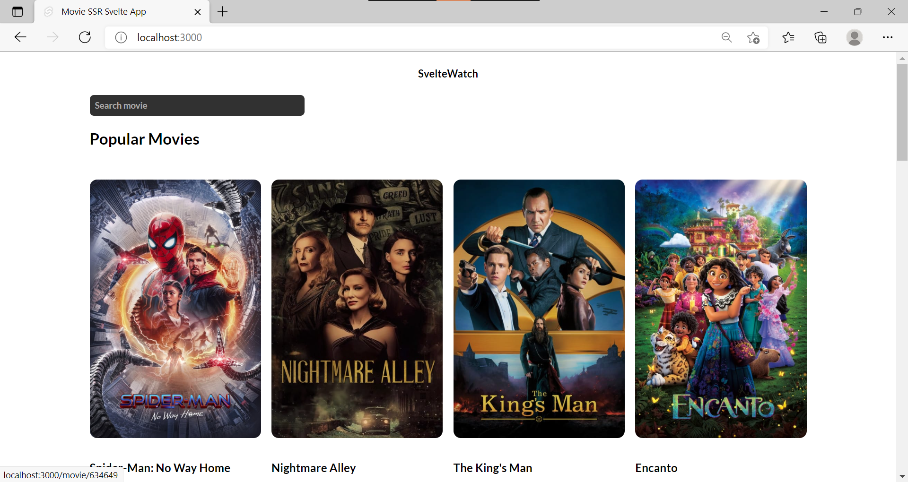
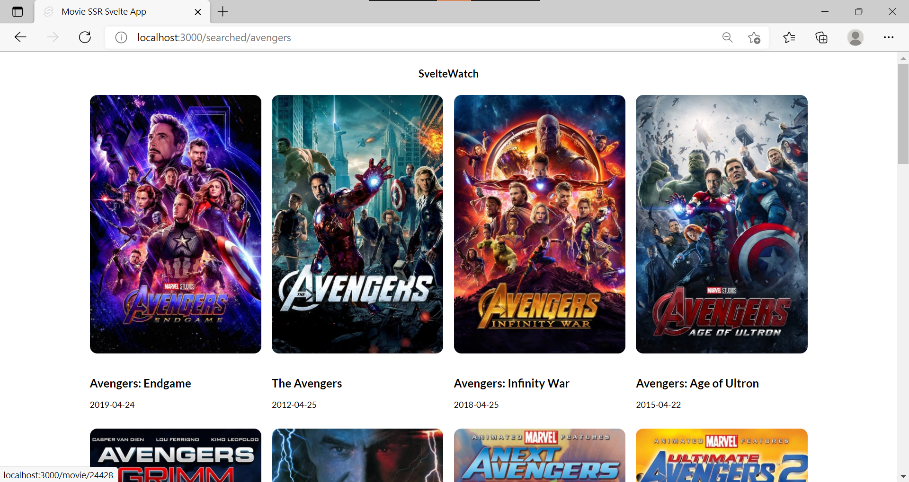

## SvelteWatch - A Svelte Web-App to show the latest and greatest movies dynamically.

### Learning SvelteKit and Svelte as it is one of the most lightweight and blazing fast web frameworks(its actually like a compilor lol) in existence. It is also closer to native HTML and Javascript. 2 way data binding has made me understand how bloated web frameworks actually are. More information [here](https://svelte.dev/docs/getting-started).

### Features

1. Dynamic Data using MovieDB API
2. Server Side Rendering using SvelteKit
3. Fixed Layouts and Nav bars.
4. Responsive Design
5. Mobile Friendly
6. Writable and Readable Svelte Stores
7. Svelte Animations
8. Navigation and Dynamic Routes using Svelte Router
9. Dynamic Routes using Svelte Router

### How to run

- Clone the repo on your local machine
- Get a MovieDB API key from [here](https://www.themoviedb.org/settings/api)
- Create a .env file and add "VITE_API_KEY=<your_api_key>". (Without the quotation marks).
- Run the following command in the root of the repo - `npm install`
- Run the following command in the root of the repo - `npm run dev`

# Images

